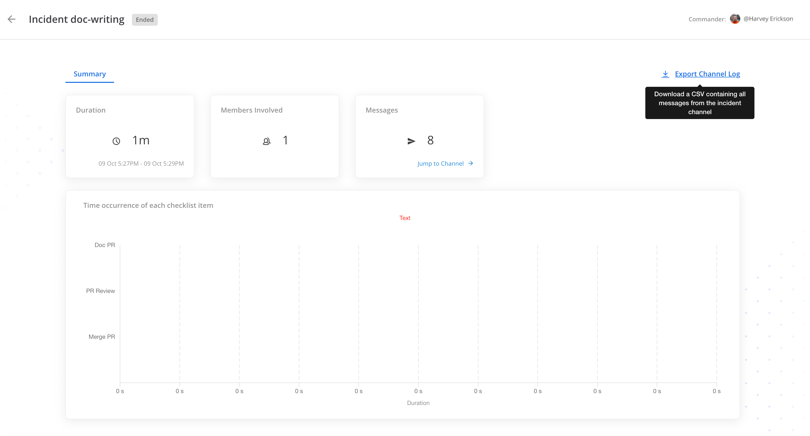

# Mattermost Channel Export Plugin

This plugin exports playbook channels into a CSV format.



See the [Mattermost Product Documentation](https://docs.mattermost.com/administration-guide/comply/export-mattermost-channel-data.html) for details on installing, configuring, enabling, and using this Mattermost integration.

---

## Table of Contents
- [Overview](#overview)
- [Features](#features)
- [Admin Guide](docs/admin-guide.md)
- [End User Guide](#end-user-guide)
  - [Get Started](#get-started)
  - [Use the Plugin](#use-the-plugin)
  - [Slash Commands](#slash-commands)
  - [FAQ](#faq)
- [Contribute](#contribute)
  - [Development](#development)
  - [Test Your Changes](#test-your-changes)
  - [Deployment](#deploy-with-local-mode)
  - [Deployment](#deploy-with-credentials)
  - [Deployment](#or-with-a-personal-access-token)
- [How to Release](#how-to-release)
- [License](#license)
- [Security Vulnerability Disclosure](#security-vulnerability-disclosure)
- [Get Help](#get-help)

---

## Overview
The Mattermost Channel Export Plugin enables exporting playbook channels to CSV files. It’s designed for admins and teams who need to retain or analyze conversation data outside Mattermost while following organizational compliance workflows.

## Features
- Export playbook channels to CSV.
- Works across supported Mattermost server versions.
- Provides deployment options for local development and production environments.
- Compatible with Marketplace and manual installation flows.

---

## End User Guide

### Get Started
Ask your system admin to install and enable the plugin. Once enabled, you’ll see export options in eligible channels depending on your organization’s configuration.

### Use the Plugin
Access the export functionality from the channel UI where it’s enabled, follow prompts to export, and download the CSV. Availability may vary based on admin configuration.

### Slash Commands
If the plugin exposes slash commands, use them from the message input (for example, `/export <options>`). Refer to your admin’s guidance for allowed parameters.

### FAQ
- **Why don’t I see export options?** The admin may not have enabled the plugin for your workspace or channel type.  
- **Where do exports go?** Typically to a downloadable file via the UI; check with your admin for storage or retention.

---

## Contribute

### Development
1. Clone the repository:
   ```bash
   git clone https://github.com/mattermost/mattermost-plugin-channel-export.git
2. Build the plugin:
  ```bash
  make
3. The build produces a single plugin file (multi‑arch) for upload to your Mattermost server:
 ```bash
  'dist/com.mattermost.plugin-channel-export.tar.gz'
  ```
4. For deployment and server configuration, see the [Admin Guide.](docs/admin-guide.md)

### Test Your Changes
-Run unit and integration tests as provided by the Makefile or CI workflows.
-For local testing, follow deployment steps in the [Admin Guide](docs/admin-guide.md) to install your built plugin on a dev server.


### Deploy with local mode

If your Mattermost server is running locally, you can enable [local mode](https://docs.mattermost.com/manage/mmctl-command-line-tool.html#local-mode) to streamline deploying your plugin. Edit your server configuration as follows:

```json
{
    "ServiceSettings": {
        ...
        "EnableLocalMode": true,
        "LocalModeSocketLocation": "/var/tmp/mattermost_local.socket"
    }
}
```

 Deploy your plugin with ``make deploy``.

You may also customize the Unix socket path if needed:

```bash
export MM_LOCALSOCKETPATH=/var/tmp/alternate_local.socket
make deploy
```

If developing a plugin with a webapp, watch for changes and deploy those automatically using ``make watch``.

### Deploy with credentials

Alternatively, you can authenticate with the server's API with credentials:

```bash
export MM_SERVICESETTINGS_SITEURL=http://localhost:8065
export MM_ADMIN_USERNAME=admin
export MM_ADMIN_PASSWORD=password
make deploy
```

### or with a [personal access token](https://developers.mattermost.com/integrate/reference/personal-access-token/):

```bash
export MM_SERVICESETTINGS_SITEURL=http://localhost:8065
export MM_ADMIN_TOKEN=j44acwd8obn78cdcx7koid4jkr
make deploy
```

## How to Release
To trigger a release, follow these steps:

1. **For Patch Release:** Run the following command:
    ```
    make patch
    ```
   This will release a patch change.

2. **For Minor Release:** Run the following command:
    ```
    make minor
    ```
   This will release a minor change.

3. **For Major Release:** Run the following command:
    ```
    make major
    ```
   This will release a major change.

4. **For Patch Release Candidate (RC):** Run the following command:
    ```
    make patch-rc
    ```
   This will release a patch release candidate.

5. **For Minor Release Candidate (RC):** Run the following command:
    ```
    make minor-rc
    ```
   This will release a minor release candidate.

6. **For Major Release Candidate (RC):** Run the following command:
    ```
    make major-rc
    ```
   This will release a major release candidate.

## License

This repository is licensed under the [Mattermost Source Available License](LICENSE) and requires a valid Enterprise Edition E20 license when used for production. See [frequently asked questions](https://docs.mattermost.com/overview/faq.html#mattermost-source-available-license) to learn more.

Although Mattermost Enterprise is required if using this plugin in production, the [Mattermost Source Available License](LICENSE) allows you to compile and test this plugin in development and testing environments without Mattermost Enterprise. As such, we welcome community contributions to this plugin.

On startup, the plugin checks for a valid Mattermost Enterprise license. If you're running an Enterprise Edition of Mattermost and don't already have a valid license, you can obtain a trial license from **System Console > Edition and License**. If you're running the Team Edition of Mattermost, including when you run the server directly from source, you may instead configure your server to enable both testing (`ServiceSettings.EnableTesting`) and developer mode (`ServiceSettings.EnableDeveloper`). These settings are not recommended in production environments.

## Security Vulnerability Disclosure
If you discover a security issue, please report it responsibly via Mattermost’s published security channels and avoid public disclosure until a fix is available.

## Get Help

- **Developer Workflow:** [Mattermost Plugin Developer Workflow](https://developers.mattermost.com/extend/plugins/developer-workflow/)  
  Learn how to build, extend, and maintain Mattermost plugins.

- **Developer Setup:** [Plugin Developer Setup Guide](https://developers.mattermost.com/extend/plugins/developer-setup/)  
  Step‑by‑step instructions for setting up your development environment.

- **Product Documentation:** [Export Channel Data](https://docs.mattermost.com/comply/export-mattermost-channel-data.html#export-channel-data)  
  Official Mattermost documentation on exporting channel data.

- **Report Issues:**  
  To report a bug or request a feature, please open a GitHub issue in this repository.

- **Community & Support:**  
  Join the Mattermost community forums or contact Mattermost support if you need additional help.

## Help and support

This plugin contains both a server and web app portion. Read our documentation about the [Developer Workflow](https://developers.mattermost.com/extend/plugins/developer-workflow/) and [Developer Setup](https://developers.mattermost.com/extend/plugins/developer-setup/) for more information about developing and extending plugins.

To report a bug, please open a GitHub issue.
